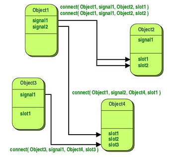

# Signal and Slot
Signals and slots are used for communication between two objects. The signal and slot mechanism is the core features of Qt, and it's also the most prominent feature of Qt that different from others development frameworks. <br/><br/>

In the GUI programming, when a component (condition) is changed, it's always hoped that other components can also understand the change. More generally, we want any object could be able to communicate with other objects. For example, if the user clicks the close button, we hope that the `close()` function of the window can be executed to close the window. In order to achieve communication between objects, some toolkits use a callback mechanism. while in Qt, signals and slots are used for communication between objects. <br/><br/>

A signal can be emitted when a special event occurs, such as a button being clicked, pressed or checked; and a slot is a function, which is called after the signal emitted to respond to the signal. Some signals and slots have been defined in Qt's component class, but more methods are to subclass this component, and then you can design some Slots to accept specific Signals and define corresponding functional actions. Signals and Slots can be connected through the static method connect of QObject. In addition, the processing between Signals and Slots is synchronized. <br/><br/>


## Signal
In the header file, add that code to declare a signals :
```cpp
signals :
    void SendSignal();
    void SendSignal(int x);
    void SendSignal(int x, int y);
```
To declare a signal, using the `signals` keyword is needed, and you cannot use public, private, and protected qualifiers before signals, because only the class that defines the signal and its subclasses can emit the signal. Moreover, the signal only needs to be declared, and it is not required to define the implement of the function. Also note that the signal has no return value and can only be of type void. Because only classes derived from the QObject class and its subclasses can use the signal and slot mechanism, so note that it's neccessary to add the `Q_OBJECT` micro in the most beginning of such class.
```cpp
void MainWindow::buttonClicked(){
    emit SendSignal();
    emit SendSignal(int);
    emit SendSignal(int,int);
}
```
Define a function that if it was called, then using `emit` to send the signal to corresponding slots.


## Slot
In the header file, add the code to declare s slots :
```cpp
public slots:
    void RequireSignal();
    void RequireSignal(int x);
    void RequireSignal(int x, int y);
```
Declaring a slot requires the use of the `slots` keyword. A slot could be of private, public, or protected type, and the slot can also be declared as a virtual function, which is the same as a normal member function, and it can also be called like a normal function. The biggest feature of slots is that they can be associated with signals.


## Connect
Signals and slots are associated using the `connect()` function of the QObject class. The prototype of this function is as follows :
```cpp
bool QObject::connect( const QObject *sender, const char *signal, const QObject *reciever, const chat *method, Qt::ConnectionType type = Qt::AutoConnection) 
```
The first parameter is the object to send the signal, such as another class or components; the second parameter is the signal to be sent, generally formated like :
```cpp
SIGNAL(SendSignal())
``` 
The third parameter is the object to receive the signal, generally it's `this`, indicating the MainWindow, namely Widget. When this parameter is `this`, that parameter can also be omitted, because the `connect()` function has another overloaded form, which defaults to `this`; and the fourth parameter is the slot to be executed , like : 
```cpp
SLOT(RequireSignal())
```
<br/>

For signals and slots, you must use the `SIGNAL()` and `SLOT()` macros, which can convert their parameters to const `char*` data types. The return value of the `connect()` function is of type bool, and it returns true when the association is successful. Also note that when calling this function, the parameters of signals and slots can only have types, not variables. Basically, the parameter types in the signal correspond to the parameter types in the slot, and the parameters in the signal can be more than the parameters in the slot, but not the other way around. If there is extra in the signal Parameters, then they will be ignored. <br/><br/>

The last parameter indicates the way of association. Its default value is `Qt::AutoConnection`. After using `emit` to send a signal, The slot will be executed, and the code following the emit statement will be executed only after the slot has been executed. You can also change this parameter to `Qt::QueuedConnection`, so that the code behind it will be executed immediately after the emit statement is executed, regardless of whether the slot has been executed. When this association is no longer used, you can also use the `disconnect()` function to disconnect the association.
```cpp
// disconnect all
disconnect(sender, 0, 0, 0);
sender->disconnect();

// disconnect specific signal
disconnect(sender, SIGNAL(SendSignal()), 0, 0);
sebder->disconnect(SIGNAL(SendSignal()));

// disconnect with reeciever
discnnect(sender, 0, reciever, 0);
sender->disconnect(reciever);
```
In the `disconnect` function, 0 can be used as a wildcard, representing any signal, any receiving object, and any slot function in the receiving object, respectively. But the sender cannot be 0.

* **Connect Automatically**
```cpp
public slots:
    void on_Button_clicked();
```
Signals and slots also has the way to connect automatically. `"on"`, the `objectName` of the component and the `signal` are composed of three parts, separated by an underscore. In this way, the slot of the name of the organization can be directly associated with the signal without using the `connect()` function. However, other settings must be made in this way.
```cpp
Widget::Widget(QWidget *parent) :
    QWidget(parent),
    ui(new Ui::Widget)
{
    QPushButton *button = new QPushButton(this);
    button->setObjectName("Button");
    ui->setupUi(this); //call this function after the component is created
}
```
Because the `connectSlotsByName()` function is called in the `setupUi()` function, the definitions of the components to be automatically associated must be placed before the `setupUi()` function, and their objectName must be specified using the `setObjectName()` function. Only in this way can it be normal Use automatic association. <br/><br/> 

In view of these constraints, although automatic association is very simple in form, it is rarely used in actual code writing. Moreover, when defining a component, it is very desirable to use the `connect()` function to associate signals and slots with it, so that when others see the component definition, they can know the correlation of the signals and slots related to it.
